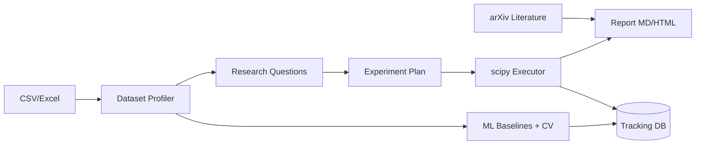

# AI Data Research Lab

[](https://github.com/lii-lii321/research-lab/actions/workflows/ci.yml)

**[中文](README.md) | English**

From one CSV to a **reproducible research report**: data profiling → research
questions → experiment plans → statistical tests → ML baselines → literature
retrieval → report export, fully automated.

**Core principle: the AI only proposes plans and interprets results — every
number comes from really executed code.** Three gates enforce this:

1. **Plan gate** — the LLM's chosen statistical method must be whitelisted
   (single-sourced with the executor) and must match the variable-type
   combination; otherwise the deterministic rule engine downgrades it, with a
   traceable note ([ADR-0001](docs/adr-0001-method-whitelist-over-codegen-sandbox.md)).
2. **Execution gate** — ten statistical tests run as hand-written, tested
   scipy code; significance decisions use unrounded p-values; effect sizes and
   raw p-values are tracked.
3. **Interpretation gate** — the LLM may only cite numbers produced by the
   executor; without a key, rule-based templates take over. Every artifact is
   labeled `llm` or `rule`.

## Who it is for

- **Data science students** — the first hour with a course/Kaggle dataset:
  upload and get a profile, testable research questions and real statistical
  tests; the report drops into your assignment appendix.
- **Researchers who need quick, defensible conclusions** — assumption checks,
  effect sizes, Benjamini–Hochberg correction and reproduction scripts, ready
  for a methods section.
- **Reviewers and interviewers** — method whitelist, source labeling, raw
  p-value tracking: the complete demo of "an AI tool that understands
  statistics".

## Three entrypoints

1. **UI**: `streamlit run app.py` — five tabs covering the whole flow
2. **CLI**: `python cli.py analyze data.csv --task "hours vs score"` —
   terminal and pipeline friendly
3. **Python API**: `from services.profiler import profile_dataset` — compose
   service layers in notebooks (see [examples/api_demo.py](examples/api_demo.py))

## Screenshots

| Analysis flow | ML lab |
|---|---|
|  |  |

**Research agent**: one sentence → timeline → report with real arXiv citations


## Architecture



## Quick start

```bash
python -m venv .venv
.venv/bin/python -m pip install -r requirements.txt   # Windows: .venv\Scripts\python

.venv/bin/python scripts/generate_sample.py           # demo dataset
.venv/bin/python -m streamlit run app.py              # UI  http://localhost:8501
.venv/bin/python -m uvicorn main:app --port 8000      # API http://localhost:8000/docs
.venv/bin/python -m pytest -q                         # tests
```

CLI (works without an LLM key — rule mode):

```bash
python cli.py profile data.csv                                   # 30-second data checkup
python cli.py analyze data.csv --task "hours vs score"           # one sentence -> full report
python cli.py experiments                                        # revisit experiments
python cli.py reports                                            # revisit reports
```

## Design decisions & roadmap

- Why not "LLM generates code + sandbox"? See
  [ADR-0001](docs/adr-0001-method-whitelist-over-codegen-sandbox.md) (Chinese).
- Systematic improvement plan with file-level manuals:
  [docs/IMPROVEMENT_MANUAL.md](docs/IMPROVEMENT_MANUAL.md) (Chinese).
- Paper reproductions: [reproductions/](reproductions/) — starting with
  Student (1908)'s paired t-test.
- Full API surface (11 endpoints) is documented at `/docs` when the server runs.

## Tests & quality

219 pytest cases (including Streamlit AppTest UI smoke tests) with an 85%
coverage CI gate, plus ruff and mypy gates — every push runs all
of them. `scripts/smoke_check.py` performs nine live end-to-end probes against
real servers (including a live arXiv retrieval).

Licensed under MIT.
