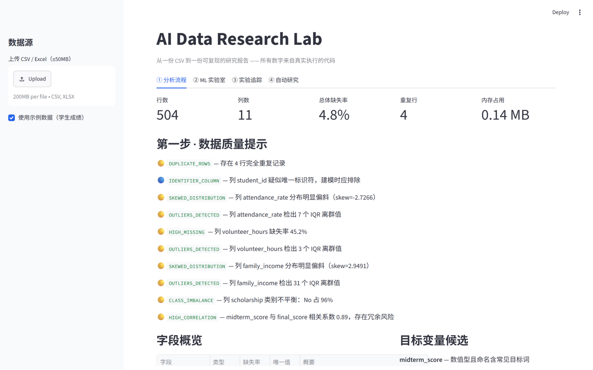
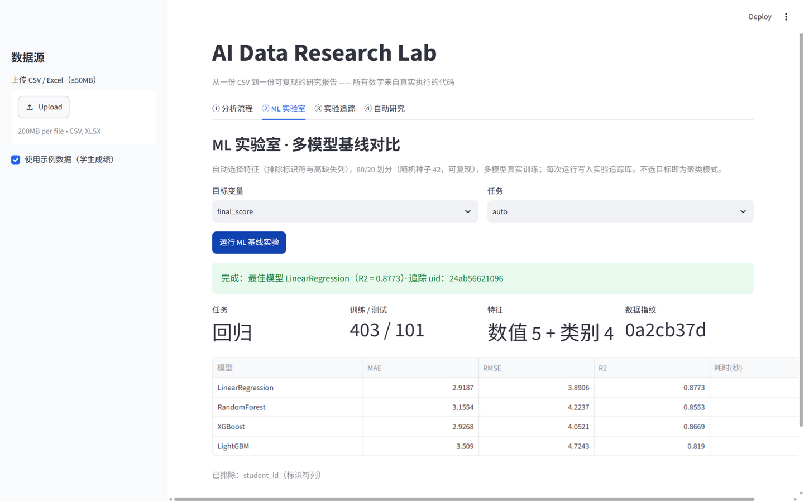
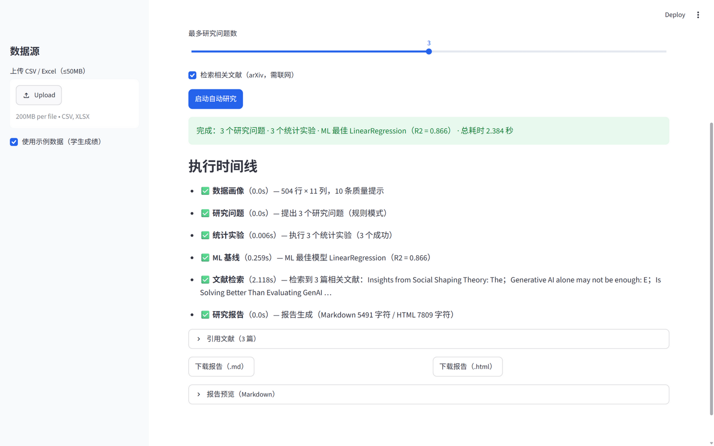

# AI Data Research Lab

[](https://github.com/lii-lii321/research-lab/actions/workflows/ci.yml)

从一份 CSV 到一份**可复现的研究报告**：数据画像 → 研究问题 → 实验计划 → 统计检验 → ML 基线 → 文献检索 → 报告导出，全自动串联。

## 为谁设计

- **数据科学学生**——拿到课程作业 / Kaggle 数据的第一小时不知从哪开始：上传即得数据画像、可检验的研究问题与真实执行的统计检验，报告可直接进作业附录。
- **需要快速出结论的研究者**——每个检验有前提校验、效应量、BH 校正与可复现脚本，论文方法论章节可直接引用。
- **评审者与面试官**——方法白名单、来源标注（llm/rule）、原始 p 值入库、复现脚本，是"懂统计的 AI 工具"最完整的展示面。

## 三个使用入口

1. **界面**：`streamlit run app.py` —— 五个标签页覆盖全流程，报告沉淀在 ⑤ 报告库
2. **命令行**：`python cli.py analyze data.csv --task "hours 与 score 的关系"` —— 接进终端与脚本管道
3. **Python API**：`from services.profiler import profile_dataset` —— 在 Notebook 里自由组合服务层（见 [examples/api_demo.py](examples/api_demo.py)）

**核心理念：AI 只负责提出计划与解释结果，所有数字来自真实执行的代码。** 三道闸保证这一点：

1. **计划层**——LLM 提出的统计方法必须在白名单内（与执行层同一来源）、必须匹配变量类型组合，不符则按规则降级并留痕（[ADR-0001](docs/adr-0001-method-whitelist-over-codegen-sandbox.md)）；
2. **执行层**——十种统计检验由人工实现、测试覆盖的 scipy 代码真实运行，显著性判定用未舍入的原始 p 值，效应量与结论一并入库；
3. **解读层**——LLM 解读只允许使用执行产出的真实数字，失败或未配置 Key 时退回规则模板，每个环节标注 `llm` / `rule` 来源。

| 分析流程 | ML 实验室 |
|---|---|
|  |  |

**自动研究 Agent**：一句话任务，全流程自动走完，附执行时间线与引用文献



## 功能一览

- **① 分析流程**：Dataset Profiler（类型推断 / 缺失重复 / IQR 离群 / 高相关 / 类别不平衡 / 目标候选）→ AI 研究问题 → 结构化实验计划（假设/方法/H0/H1/α）→ 真实执行（散点/箱线/柱状配图）→ Markdown + HTML 研究报告（含 BH 校正结论表、复现脚本附录、局限声明）
- **② ML 实验室**：回归 / 分类 / 聚类多模型基线（Linear / Logistic / RandomForest / XGBoost / LightGBM），分层 k 折交叉验证选优，特征守门自动排除标识符与高缺失列，随机种子 42 可复现
- **③ 实验追踪**：统计实验与 ML 实验统一入 SQLite——数据指纹、特征集、超参、指标、p 值、时间戳；同数据集同任务的指标趋势图
- **④ 自动研究**：一句话任务 → 全流程 → 报告；零 Key 可跑（规则模式），结果全程可溯源

## 快速开始

```bash
python -m venv .venv
.venv\Scripts\python -m pip install -r requirements.txt -i https://pypi.tuna.tsinghua.edu.cn/simple   # macOS/Linux: .venv/bin/python

.venv\Scripts\python scripts\generate_sample.py        # 生成示例数据
.venv\Scripts\python -m streamlit run app.py           # 界面 http://localhost:8501
.venv\Scripts\python -m uvicorn main:app --port 8000   # API 文档 http://localhost:8000/docs
.venv\Scripts\python -m pytest -q                      # 测试
```

命令行用法（零配置即可跑，规则模式不需要 Key）：

```bash
python cli.py profile data.csv                                   # 30 秒看懂一份数据
python cli.py analyze data.csv --task "hours 与 score 的关系"     # 一句话任务 → 全流程报告
python cli.py experiments                                        # 回看所有实验
python cli.py reports                                            # 回看所有报告
```

## Docker

```bash
docker compose up --build   # API http://localhost:8000 · UI http://localhost:8501（仅回环绑定）
```

## LLM 配置（可选）

```bash
copy .env.example .env    # 填入 AI_API_KEY（SiliconFlow / 智谱 / DeepSeek 等 OpenAI 兼容服务均可）
```

不配置 Key 时一切照常运行：研究问题退回规则模式、计划与解读退回规则模板，所有环节标注来源。

## API

`POST /api/profile` · `POST /api/research-questions` · `POST /api/experiment-plan` · `POST /api/execute-experiment` · `POST /api/report` · `POST /api/ml-experiment` · `GET /api/experiments` · `GET /api/experiments/{uid}` · `POST /api/agent/run`

## 设计决策与路线

- 为什么不做"LLM 生成代码 + 沙箱"？见 [ADR-0001](docs/adr-0001-method-whitelist-over-codegen-sandbox.md)
- 三阶段路线与反范围承诺见 [PROJECT_BRIEF.md](PROJECT_BRIEF.md)，版本历史见 [CHANGELOG.md](CHANGELOG.md)
- Phase 1 统计流水线（已完成）→ Phase 2 ML + 实验追踪（已完成）→ Phase 3 Research Agent（主体完成，LLM 自主决策模式待 Key）

## 测试与质量

pytest 135 用例（含 Streamlit AppTest 界面级冒烟），CI 每次推送全量运行；
`scripts/smoke_check.py` 对真实启动的 API 与 UI 做九项端到端探活（含真实 arXiv 检索）。
